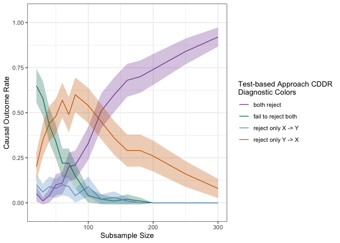
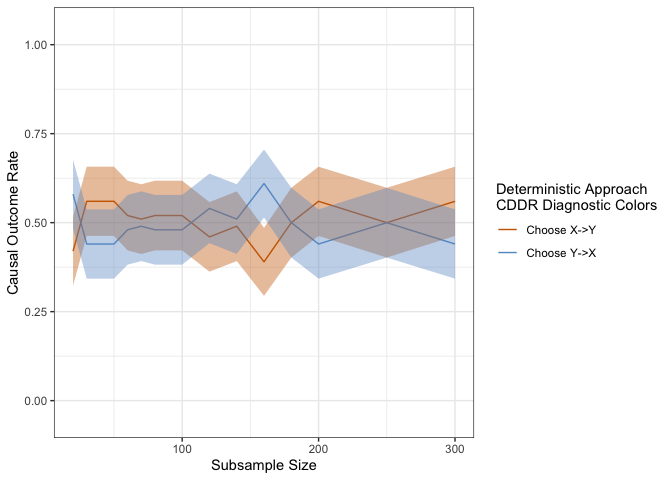

<!-- README.md is generated from README.Rmd. Please edit that file -->

# causalDiagnose

<!-- badges: start -->
<!-- badges: end -->

This diagnostic tool for functional causal discovery is based on the
paper “A General Diagnostic Tool for Functional Causal Discovery.” By
providing your dataset of size N, the functional causal model, and a
vector of subsample sizes less than or equal to N, along with some
additional details, you can obtain the CDDR diagnostic. This diagnostic
plots the probability of each causal discovery outcome (e.g., X causes
Y, Y causes X, or inconclusive) as a function of the subsample sizes.

## Installation

You can install the development version of causalDiagnose from
[GitHub](https://github.com/) with:

``` r
# install.packages("devtools")
devtools::install_github("shreyap18/causalDiagnose")
```

## Example

This is an example to obtain the CDDR diagnostic applied to the
test-based approach for the Population and Food consumption dataset
shown in the paper. Note that if we were to update functions for fitting
and predicting to those based on, for example, additive noise models
(ANM), we would be obtaining a CDDR diangostic for a test-based version
of ANMs. More details are provided in the discussion section of the
paper.

``` r
library(causalDiagnose)
samplesizes <- c(seq(20, 70, 10), seq(80, 180, 20), seq(200, 300, 50))
fit_resid_yonx <- function(data) {
  model <- lm(formula("y~x"), data = data)
  resids <- residuals(model)
  model_obs <- list(model = model, residuals = resids)
  return(model_obs)
  }
predict_yonx <- function(model, data) {
  preds <- predict(model,newdata = data)
  return(preds)
  }
fit_resid_xony <- function(data) {
  model <- lm(formula("x~y"), data = data)
  resids <- residuals(model)
  model_obs <- list(model = model, residuals = resids)
  return(model_obs)
  }
predict_xony <- function(model, data) {
  preds <- predict(model,newdata = data)
  return(preds)
  }
names_col_cddr <- c("samplesizes", "yonx_and_xony_reject",
"yonx_and_xony_noreject", "yonx_reject_xony_noreject",
"xony_reject_yonx_noreject")

## can change to directory of the user's choice
main_dir <- "~/Documents/cddr_paper/package/test"
name_files <- c("cddr_samp", "p_valsxy_samp", "p_valsyx_samp")
name_out <- c("cddr_test_pop_cal", "p_valsxy_pop_cal", "p_valsyx_pop_cal")

## obtaining estimated outcome rates
cddr_test_pop_cal <- run_procedure(pop_cal, main_dir, samplesizes, names_col_cddr, name_files, name_out, fit_resid_yonx, predict_yonx, fit_resid_xony, predict_xony)
#> Warning in dir.create(main_dir):
#> '/Users/shreyaprakash/Documents/cddr_paper/package/test/samplesize120' already
#> exists

## getting CDDR diagnostic
outcome_columns <- c("yonx_and_xony_reject", "yonx_and_xony_noreject",
"yonx_reject_xony_noreject", "xony_reject_yonx_noreject")
dataset_names <- c("p11", "p00", "p01", "p10")
cddr_plot_test_pop_cal <- get_diagnose_plot(cddr_test_pop_cal, outcome_columns, dataset_names)
cddr_plot_test_pop_cal
```



This is an example to obtain the CDDR diagnostic applied to LiNGAM for
the Population and Food consumption dataset shown in the paper.

``` r
library(causalDiagnose)
samplesizes <- c(seq(20, 70, 10), seq(80, 180, 20), seq(200, 300, 50))
names_col_cddr <- c("samplesizes", "order_right", "order_left")

## can change to directory of the user's choice
main_dir <- "~/Documents/cddr_paper/package/test"
name_files <- c("cddr_deter_samp")
name_out <- c("cddr_lingam_pop_cal")

## obtaining estimated outcome rates
cddr_lingam_pop_cal <- run_procedure(pop_cal, main_dir, samplesizes, names_col_cddr, name_files, name_out, run_test = FALSE, early_stop_thresh = 0.95)

## getting CDDR diagnostic
outcome_columns <- c("order_right", "order_left")
dataset_names <- c("d1", "d2")
cddr_plot_lingam_pop_cal <- get_diagnose_plot(cddr_lingam_pop_cal, outcome_columns, dataset_names, is_test = FALSE)
cddr_plot_lingam_pop_cal
```


This is an example to obtain the CDDR diagnostic applied to a trivial
causal discovery method that outputs the causal ordering c(1,2) with
probability 0.5 for the Population and Food consumption dataset. This
showcases how to apply the CDDR diagnostic to any deterministic
bivariate functional causal discovery method.

``` r
library(causalDiagnose)
samplesizes <- c(seq(20, 70, 10), seq(80, 180, 20), seq(200, 300, 50))
names_col_cddr <- c("samplesizes", "order_right", "order_left")

## can change to directory of the user's choice
main_dir <- "~/Documents/cddr_paper/package/test"
name_files <- c("cddr_deter_samp")
name_out <- c("cddr_random_pop_cal")
run_causal_method <- function(data){
  p <- rbinom(1, 1, p = 0.5)
    if (p == 0){
      return(c(1,2))}
   else{
      return(c(2,1))
   }}

## obtaining estimated outcome rates
cddr_random_pop_cal <- run_procedure(pop_cal, main_dir, samplesizes, names_col_cddr,name_files, name_out, run_test = FALSE, run_lingam = FALSE, run_causal_method = run_causal_method, early_stop_thresh = 0.95)

## getting CDDR diagnostic
outcome_columns <- c("order_right", "order_left")
dataset_names <- c("d1", "d2")
cddr_plot_random_pop_cal <- get_diagnose_plot(cddr_random_pop_cal, outcome_columns, dataset_names, is_test = FALSE)
cddr_plot_random_pop_cal
```


